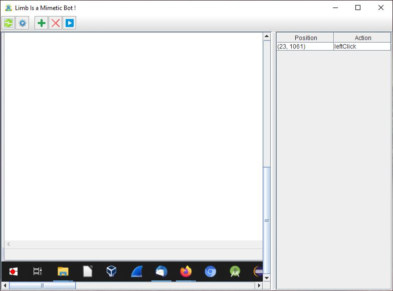

# Limb
A bot to reproduce graphical user actions

## How to use
Click on the screen and use the add button. An action is added in the table with the coordinate x,y of the action and the wanted action (see the list below).  
To run, just click on the run button and type the number of wanted iteration.

## Available actions

* `leftClick`: reproduce a user left click
* `doubleLeftClick`: reproduce a double user left click
* `rightClick`: reproduce a user rigth click
* `selectAll`: reproduce a user `ctrl + a`
* `down`: reproduce a user page down
* `altTab`: reproduce a user `alt + tab`
* `ctrlEnd`: reproduce a user `ctrl + end`
* `copy`: reproduce a user `ctrl + c`
* `paste`: reproduce a user `ctrl + v`
* `copyPaste`: reproduce a user `ctrl + c/v`
* `enter`: reproduce a user `enter`
* `some text`: reproduce a text from the keyboard